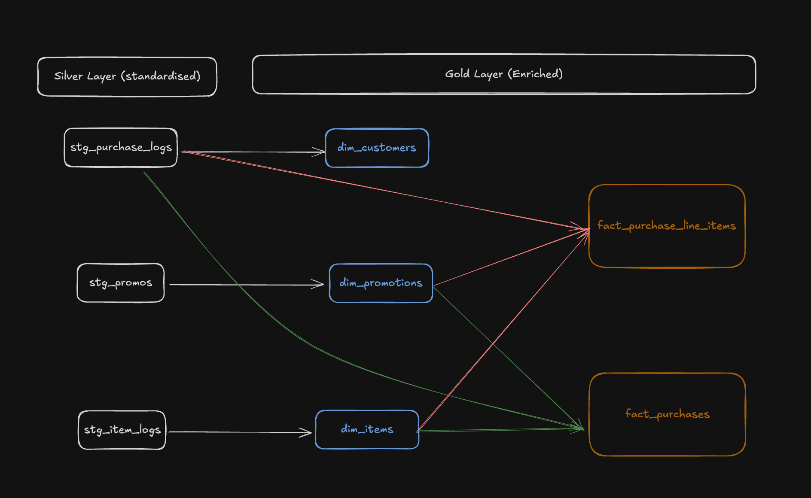
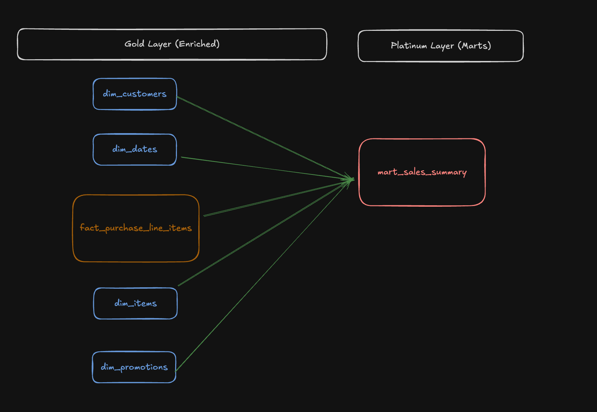
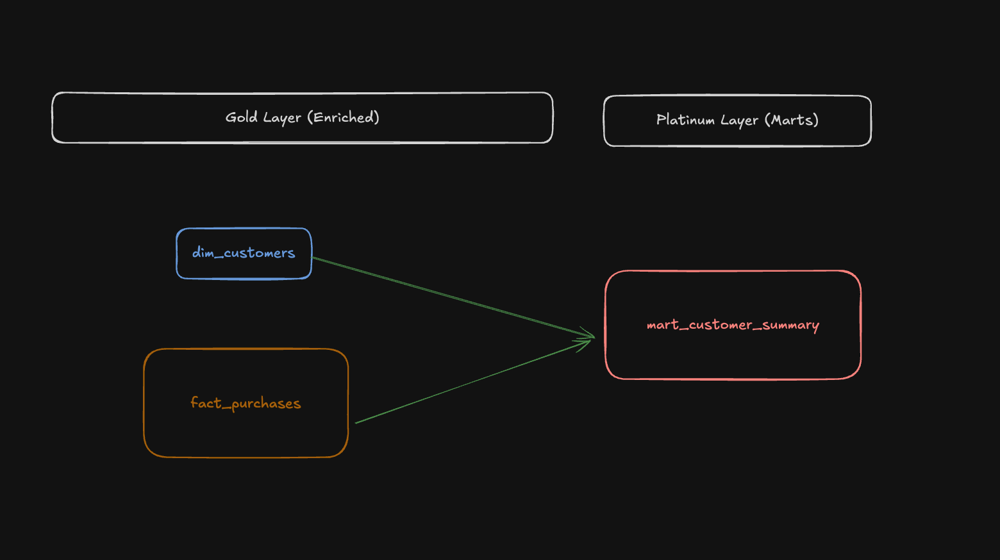
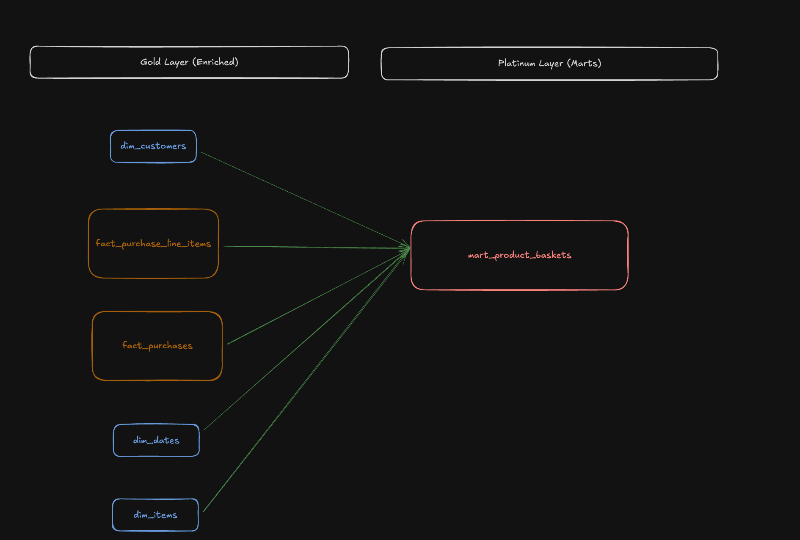
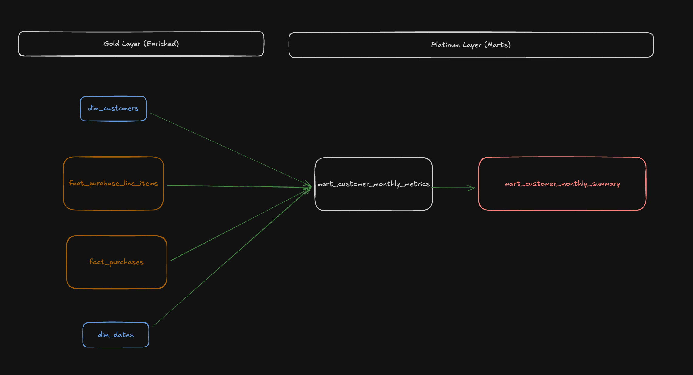
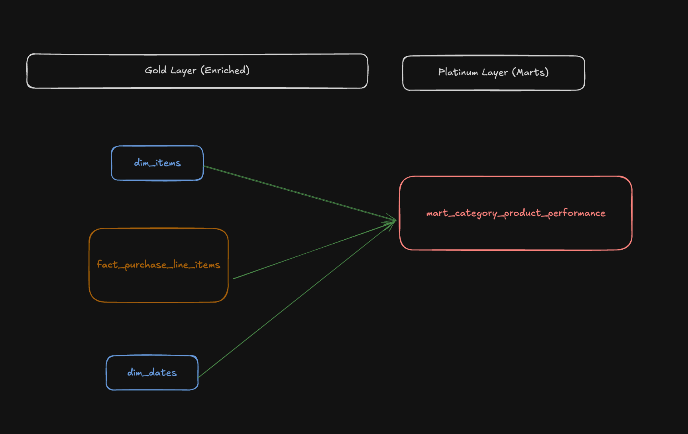

# Retail Data Model

A dbt project for modeling retail/snack store transaction data using DuckDB.

## 🏗️ Architecture Overview

This project implements a **Medallion Architecture** with four distinct layers:

### Layer Details

| Layer | Schema | Purpose | Models | Key Features |
|-------|--------|---------|--------|--------------|
| **Bronze** | `landing` | Raw data ingestion | CSV seeds | Unprocessed, as-is data from source files |
| **Silver** | `standardized` | Data cleaning & standardization | `stg_*` | JSON parsing, type conversion, deduplication, **incremental processing** (where applicable), all monetary values rounded to 2 decimal places |
| **Gold** | `dimensions` & `facts` | Business logic & dimensional modeling | `dim_*` & `fact_*` | Star schema, SCD Type 2 for items, aggregations, relationships, **incremental processing** (where applicable) |
| **Platinum** | `marts` | Business intelligence | `mart_*` | Pre-joined dimensions, pre-aggregated metrics, marketplace-based classifications, customer segmentation, enables analysts to answer business questions with minimal SQL |

## Project Structure

```
retail_data_model/
├── models/
│   ├── standardized/     # Silver layer (stg_* models)
│   ├── enriched/
│   │   ├── dim/          # Dimension tables
│   │   └── facts/        # Fact tables
│   └── reports/            # Platinum layer (mart_* models)
├── seeds/                # CSV seed files
├── tests/                # Custom data tests
├── macros/               # dbt macros (if any)
├── dbt_project.yml       # Project configuration
├── packages.yml          # Package dependencies
└── README.md            # This file
```

## 🚀 Getting Started

This section provides step-by-step instructions for setting up and running the project from scratch.

### Prerequisites

Before you begin, ensure you have the following installed:

- **Python 3.8+** - [Download Python](https://www.python.org/downloads/)
- **dbt Core 1.11+** - Install via pip: `pip install dbt-core dbt-duckdb`
- **DuckDB** - Automatically included with `dbt-duckdb` adapter (no separate installation needed)

### Installation Steps

1. **Clone or download the project**
   ```bash
   cd /path/to/your/projects
   # If using git:
   git clone https://github.com/BieNewBie/Wolt
   cd retail_data_model
   ```

2. **Create a Python virtual environment (recommended)**
   ```bash
   python -m venv venv
   source venv/bin/activate  # On Windows: venv\Scripts\activate
   ```

3. **Install dbt and DuckDB adapter**
   ```bash
   pip install dbt-core dbt-duckdb
   ```

4. **Install dbt packages (dependencies)**
   ```bash
   dbt deps
   ```
   This installs the `dbt_utils` package required by the project.

5. **Configure dbt profile**

   Create a `profiles.yml` file in `~/.dbt/` (or `%USERPROFILE%\.dbt\` on Windows) with the following content:

   ```yaml
   retail_data_model:
     outputs:
       dev:
         type: duckdb
         path: retail_data_model.duckdb
         schema: main
     target: dev
   ```

   **Note**: The `path` should be relative to your project directory or an absolute path. The database file will be created automatically on first run.

6. **Verify your connection**
   ```bash
   dbt debug
   ```
   This command checks your dbt installation, profile configuration, and database connection.

### Running the Project

1. **Load seed data (CSV files)**
   ```bash
   dbt seed
   ```
   This loads the raw CSV files from the `seeds/` directory into the `landing` schema as tables:
   - `snack_store_item_logs.csv` → `landing.snack_store_item_logs`
   - `snack_store_promos.csv` → `landing.snack_store_promos`
   - `snack_store_purchase_logs.csv` → `landing.snack_store_purchase_logs`

2. **Build all models**
   ```bash
   dbt run
   ```
   This builds all models in the correct dependency order:
   - Standardized layer (Silver): `stg_*` models
   - Enriched layer (Gold): `dim_*` and `fact_*` models
   - Reports layer (Platinum): `mart_*` models

3. **Run all tests**
   ```bash
   dbt test
   ```
   This validates data quality, business rules, and referential integrity across all models.

### Common Commands

**Build specific models:**
```bash
# Run a single model
dbt run --select stg_purchase_logs

# Run all models in a folder
dbt run --select models/standardized

# Run a model and its downstream dependencies
dbt run --select stg_purchase_logs+
```

**Test specific models:**
```bash
# Test a single model
dbt test --select stg_purchase_logs

# Test all models in a folder
dbt test --select models/standardized
```

**Full refresh (rebuild incremental models from scratch):**
```bash
# Full refresh all models
dbt run --full-refresh

# Full refresh a specific model
dbt run --select stg_purchase_logs --full-refresh
```

**Important Note**: When running full refresh on multiple models, use `--threads 1` to avoid concurrency issues:
```bash
dbt run --full-refresh --threads 1
```

**Generate documentation:**
```bash
# Generate and serve documentation
dbt docs generate
dbt docs serve
```
This opens an interactive documentation site in your browser with model lineage, column descriptions, and test results.

### Troubleshooting

**Issue: `dbt found 1 package(s) specified in packages.yml, but only 0 package(s) installed`**
- **Solution**: Run `dbt deps` to install package dependencies

**Issue: `Catalog "retail_data_model" does not exist!`**
- **Solution**: The database file will be created automatically on first run. Make sure your `profiles.yml` path is correct.

**Issue: `IO Error: Could not set lock on file`**
- **Solution**: Another DuckDB process is using the database. Close other connections or wait for the lock to be released. For full refresh operations, use `--threads 1` to avoid concurrency issues.

**Issue: `Compilation Error` or `Parser Error`**
- **Solution**: Check that all dependencies are installed (`dbt deps`) and that your dbt version is compatible (1.11+)

**Issue: Tests failing**
- **Solution**: Review the test output to identify data quality issues. Check `DATA_QUALITY_ISSUES.md` for known issues and how they're handled.

### Next Steps

Once you've successfully run the project:

1. **Explore the marts**: Query the `marts` schema tables to answer business questions
2. **Review documentation**: Check `DATA_QUALITY_ISSUES.md` for known data quality issues
3. **Run example queries**: See the "Example Queries" sections in each mart description
4. **Generate docs**: Run `dbt docs generate && dbt docs serve` to explore the data lineage

## Documentation

- **[DATA_DICTIONARY.md](DATA_DICTIONARY.md)**: Comprehensive data dictionary for all tables in Silver, Gold, and Platinum layers with column descriptions
- **[DATA_QUALITY_ISSUES.md](DATA_QUALITY_ISSUES.md)**: Known data quality issues and how they're handled

**Note**: Custom data tests are written in the `tests/` folder. These tests validate business rules, data quality, and referential integrity across the data model.

## Layer Details

### Bronze Layer (Landing)

The Bronze layer contains raw, unprocessed data loaded directly from CSV seed files.

| Table | Purpose | Grain |
|-------|---------|-------|
| `landing.snack_store_item_logs` | Raw item catalog data with JSON payload containing product information | One row per item log entry (may contain duplicate `LOG_ITEM_ID` values - see DATA_QUALITY_ISSUES.md) |
| `landing.snack_store_promos` | Raw promotional campaign data | One row per promotion (item + date range) |
| `landing.snack_store_purchase_logs` | Raw purchase transaction data with JSON basket containing multiple items | One row per `PURCHASE_KEY` (purchase transaction) |

### Silver Layer (Standardized)

The Silver layer contains cleaned, standardized, and deduplicated data ready for business logic.

| Table | Purpose | Grain |
|-------|---------|-------|
| `standardized.stg_item_logs` | Standardized item logs with cleaned data types and parsed JSON payload. Implements deduplication logic to handle duplicate `LOG_ITEM_ID` values. | One row per `log_item_id` (deduplicated) |
| `standardized.stg_promos` | Standardized promotional campaigns with cleaned data types and validated date ranges | One row per promotion (`item_key` + `promo_start_date` + `promo_end_date`) |
| `standardized.stg_purchase_logs` | Standardized purchase logs with expanded basket items. Expands JSON basket array into individual line items. | One row per `purchase_key` + `item_key` (purchase line item) |

### Gold Layer (Enriched)

The Gold layer contains business logic, dimensional modeling, and aggregated data organized in a star schema.

**Dimension Tables** (`dimensions` schema):

| Table | Purpose | Grain |
|-------|---------|-------|
| `dimensions.dim_items` | Item dimension with SCD Type 2 tracking for historical changes. Tracks item attributes over time with `valid_from` and `valid_to` dates. | One row per `log_item_id` per valid time period (SCD Type 2) |
| `dimensions.dim_customers` | Customer dimension with descriptive attributes. Tracks customer information and purchase dates. | One row per `customer_key` |
| `dimensions.dim_promotions` | Promotion dimension for date range joining. Handles active promotions with exclusive end date logic. | One row per promotion (`item_key` + `promo_start_date` + `promo_end_date_exclusive`) |
| `dimensions.dim_dates` | Date dimension for time-based analysis. Contains date attributes (year, quarter, month, season, etc.) for all dates in the analysis period. | One row per date (2022-01-01 to 2025-12-31) |

**Fact Tables** (`facts` schema):

| Table | Purpose | Grain |
|-------|---------|-------|
| `facts.fact_purchase_line_items` | Transaction-level fact table with line item details. Contains measures (revenue, discounts, fees) and foreign keys to dimensions. | One row per `purchase_key` + `item_key` (one row per item in each purchase) |
| `facts.fact_purchases` | Purchase-level aggregated fact table. Contains purchase-level measures aggregated from line items. | One row per `purchase_key` (one row per purchase transaction) |

**Data Flow from Standardized to Enriched Layer**:



### Platinum Layer (Reports)

The Platinum layer provides pre-joined and pre-aggregated tables (marts) that make it easy for analysts to answer business questions with minimal SQL. All marts are located in the `marts` schema.

The marts are organized into subfolders by domain for better maintainability and organization:

```
models/reports/
├── customer_reports/          # Customer-focused marts
│   ├── mart_customer_summary.sql
│   ├── mart_customer_monthly_metrics.sql      # Base table (intermediate)
│   ├── mart_customer_monthly_summary.sql       # Uses mart_customer_monthly_metrics
│   └── schema.yml
├── sales_reports/             # Sales-focused marts
│   ├── mart_sales_summary.sql
│   └── schema.yml
└── product_reports/           # Product-focused marts
    ├── mart_product_baskets.sql
    ├── mart_category_product_performance.sql
    └── schema.yml
```

**Subfolder Organization**:
- **`customer_reports/`**: Customer behavior and engagement marts
  - `mart_customer_summary`: Customer-level lifetime aggregations
  - `mart_customer_monthly_metrics`: Base table with monthly metrics only (intermediate table)
  - `mart_customer_monthly_summary`: Built from `mart_customer_monthly_metrics`, adds running totals and segments
- **`sales_reports/`**: Sales transaction and line item marts (`mart_sales_summary`)
- **`product_reports/`**: Product performance and basket analysis marts (`mart_product_baskets`, `mart_category_product_performance`)

Each subfolder contains its own `schema.yml` file with model documentation and tests.

### Available Marts

#### 1. `marts.mart_sales_summary`
**Grain**: One row per purchase line item with all dimensions pre-joined

**Purpose**: Answer most business questions with simple filters and GROUP BYs

**Key Features**:
- Pre-joined with all dimensions (items, customers, dates, promotions)
- Includes all item attributes (category, brand, name)
- Includes all customer attributes (first purchase date, repeat purchase flags)
- Includes all date attributes (year, quarter, month, season, etc.)
- Includes delivery distance category
- Includes all calculated metrics (prices, discounts, fees, revenue)



**Example Queries**:
```sql
-- What items are being bought and what price?
SELECT item_category, item_name_en, 
       AVG(unit_price_at_purchase) as avg_price,
       SUM(item_count) as total_quantity
FROM marts.mart_sales_summary
WHERE order_date >= '2023-01-01'
GROUP BY item_category, item_name_en;

-- How many items on promotion?
SELECT year, quarter,
       SUM(CASE WHEN is_on_promotion THEN item_count ELSE 0 END) as items_on_promo
FROM marts.mart_sales_summary
GROUP BY year, quarter;

-- Revenue by period?
SELECT year, month, month_name,
       SUM(line_item_value_after_discount) as revenue
FROM marts.mart_sales_summary
GROUP BY year, month, month_name
ORDER BY year, month;
```

#### 2. `marts.mart_customer_summary`
**Grain**: One row per customer with aggregated metrics across their entire lifetime

**Purpose**: Enable analysts to answer customer behavior questions with minimal SQL. Pre-aggregates customer-level metrics from fact tables.

**Key Features**:
- Customer-level aggregations (total purchases, total revenue, avg basket size, avg order value)
- Customer lifetime metrics (days since first/last purchase, customer lifetime days)
- Item metrics (total items purchased, avg items per order)
- Fee metrics (total fees, avg fees as percent of basket)
- Promotion usage metrics (promotions used, % of purchases with promotions, % of items on promotion, discount savings %)
- Customer segmentation (One-Time, Occasional, Regular, Frequent, Very Frequent Customer) based on purchase frequency
- Customer value segmentation (Low, Medium, High, Very High Value) based on total revenue



**Segmentation Thresholds** (Quartile-based):
- **`customer_segment`**: Based on purchase frequency - 1 purchase, 2-25 (P25), 26-40 (P50), 41-63 (P75), 64+ (above P75)
- **`customer_value_segment`**: Based on total revenue - €0, €0.01-190 (P25), €191-310 (P50), €311-490 (P75), €491+ (above P75)

**Example Queries**:
```sql
-- Which customers are 'Promo Hunters'?
SELECT 
    customer_key,
    customer_segment,
    total_purchases,
    total_revenue,
    promotion_usage_percentage,
    items_on_promotion_percentage,
    discount_savings_percentage
FROM marts.mart_customer_summary
WHERE promotion_usage_percentage >= 20
ORDER BY promotion_usage_percentage DESC;

-- Identification of "At-Risk" High Value Customers
SELECT 
    customer_key,
    total_revenue,
    days_since_last_purchase,
    customer_lifetime_days
FROM marts.mart_customer_summary
WHERE customer_value_segment = 'Very High Value'
  AND days_since_last_purchase > 30
ORDER BY days_since_last_purchase DESC;

-- Customer recency pattern analysis
SELECT 
    CASE 
        WHEN days_since_last_purchase <= 7 THEN 'Active (0-7 days)'
        WHEN days_since_last_purchase <= 30 THEN 'Recent (8-30 days)'
        WHEN days_since_last_purchase <= 90 THEN 'Inactive (31-90 days)'
        ELSE 'Churned (>90 days)'
    END as recency_category,
    COUNT(*) as customer_count,
    AVG(total_revenue) as avg_revenue,
    AVG(total_purchases) as avg_purchases
FROM marts.mart_customer_summary
GROUP BY recency_category
ORDER BY 
    CASE recency_category
        WHEN 'Active (0-7 days)' THEN 1
        WHEN 'Recent (8-30 days)' THEN 2
        WHEN 'Inactive (31-90 days)' THEN 3
        ELSE 4
    END;

-- Do customers with higher promo usage have higher value?
SELECT 
    CASE 
        WHEN promotion_usage_percentage = 0 THEN 'No Promo Usage'
        WHEN promotion_usage_percentage < 25 THEN 'Low Promo Usage (1-24%)'
        WHEN promotion_usage_percentage < 50 THEN 'Medium Promo Usage (25-49%)'
        WHEN promotion_usage_percentage < 75 THEN 'High Promo Usage (50-74%)'
        ELSE 'Very High Promo Usage (75%+)'
    END as promo_usage_category,
    COUNT(*) as customer_count,
    AVG(total_revenue) as avg_revenue,
    AVG(total_purchases) as avg_purchases,
    AVG(discount_savings_percentage) as avg_discount_savings_pct
FROM marts.mart_customer_summary
GROUP BY promo_usage_category
ORDER BY avg_revenue DESC;
```

#### 3. `marts.mart_product_baskets`
**Grain**: One row per purchase with item combination details

**Purpose**: Enable analysts to answer product combination questions with minimal SQL. Shows which items are bought together in each purchase and enables product recommendation analysis.

**Key Features**:
- Item lists: `item_names_list` (pipe-separated names), `item_keys_list` (comma-separated keys), `categories_list` (pipe-separated categories)
- Basket composition: Size classification (Single Item, Two Items, Small/Medium/Large Basket), category diversity (Single/Two/Multi-Category)
- Purchase metrics: Basket value, order value, items, promotions, fees, delivery distance
- Date and customer attributes: Year, quarter, month, season, weekend, first purchase date, repeat purchase flag
- Product recommendations: Use `item_keys_list` to analyze product co-occurrences



**Example Queries**:
```sql
-- Do products get bought together? (Find most common exact basket combinations)
SELECT item_keys_list,
       COUNT(*) as frequency,
       AVG(total_basket_value) as avg_basket_value
FROM marts.mart_product_baskets
GROUP BY item_keys_list
ORDER BY frequency DESC
LIMIT 10;

-- Basket composition analysis
SELECT basket_size,
       basket_category_diversity,
       COUNT(*) as purchase_count,
       AVG(total_basket_value) as avg_basket_value,
       AVG(total_items) as avg_items
FROM marts.mart_product_baskets
GROUP BY basket_size, basket_category_diversity
ORDER BY purchase_count DESC;

-- Find customers who repeat exact basket combinations
SELECT 
    customer_key,
    item_keys_list,
    COUNT(*) as repeat_count,
    AVG(total_basket_value) as avg_value
FROM marts.mart_product_baskets
GROUP BY customer_key, item_keys_list
HAVING COUNT(*) > 1
ORDER BY repeat_count DESC
LIMIT 20;
```

#### 4. `marts.mart_customer_monthly_summary`
**Grain**: One row per customer per month with monthly metrics, running totals, and customer segments

**Purpose**: Enable analysts to answer customer behavior over time and retention questions with minimal SQL

**Note**:
- This model only includes months where customers made purchases. If a customer doesn't purchase in a month, they won't have a row for that month. This means retention analysis should compare active customers in each month to the original cohort size.
- This mart is built from `mart_customer_monthly_metrics` (an intermediate/base incremental table) which contains only monthly metrics. `mart_customer_monthly_summary` adds running totals and customer segments using window functions over the base table.

**Key Features**:
- Monthly activity metrics (purchases, revenue, promotion usage, fees)
- Running totals (till-date) for cumulative metrics (total purchases, revenue, items, fees, etc.)
- Cohort information (first purchase month, months since first purchase, cohort labels)
- First-time customer analysis (`is_first_month` flag, promotion-only purchases, promotion usage percentage)
- Customer segmentation at month end (based on total purchases till date)

**Customer Segmentation Thresholds** (Quartile-based):
- **`customer_segment_at_end_of_month`**: Based on total purchases till date - No Purchases (0), One-Time (1), Occasional (2-25), Regular (26-40), Frequent (41-63), Very Frequent (64+)

**This mart enables analysts to answer**:
- Retention analysis: "January cohort active in February/March/etc." (compare active customers in each month to original cohort size)
- First-time customer + promotions: Filter `is_first_month = true`, check promotion flags
- Customer engagement trends: Month-over-month analysis
- Customer behavior over time: Track engagement patterns
- Customer segmentation: Use `customer_segment_at_end_of_month` to analyze customer evolution



**Sample Retention Query**:
```sql
-- Calculate retention rate: active customers in each month vs original cohort size
WITH original_cohort AS (
    SELECT COUNT(DISTINCT customer_key) as original_size
    FROM marts.mart_customer_monthly_summary
    WHERE cohort_month_label = '2023-01' AND is_first_month = true
),
monthly_activity AS (
    SELECT 
        year,
        month,
        COUNT(DISTINCT customer_key) as active_customers
    FROM marts.mart_customer_monthly_summary
    WHERE cohort_month_label = '2023-01'
    GROUP BY year, month
)
SELECT 
    m.year,
    m.month,
    c.original_size as cohort_size,
    m.active_customers as retained_customers,
    ROUND(m.active_customers * 100.0 / c.original_size, 2) as retention_rate_pct
FROM monthly_activity m
CROSS JOIN original_cohort c
ORDER BY m.year, m.month;
```

**Example Queries**:
```sql
-- First-time customers through promotions?
SELECT 
    COUNT(DISTINCT customer_key) as first_time_customers,
    COUNT(DISTINCT CASE WHEN promotion_only_purchase_first_month THEN customer_key END) as promotion_only_customers,
    COUNT(DISTINCT CASE WHEN has_promotion_items_first_month THEN customer_key END) as customers_with_promos,
    ROUND(AVG(promotion_usage_percentage_first_month), 2) as avg_promo_usage_pct,
    ROUND(COUNT(DISTINCT CASE WHEN promotion_only_purchase_first_month THEN customer_key END) * 100.0 / 
          COUNT(DISTINCT customer_key), 2) as promotion_only_pct
FROM marts.mart_customer_monthly_summary
WHERE is_first_month = true;

-- Customer engagement trends: Month-over-month analysis
SELECT 
    year,
    month,
    COUNT(DISTINCT customer_key) as active_customers,
    SUM(purchases_this_month) as total_purchases,
    ROUND(AVG(purchases_this_month), 2) as avg_purchases_per_customer,
    ROUND(SUM(revenue_this_month), 2) as total_revenue,
    ROUND(AVG(revenue_this_month), 2) as avg_revenue_per_customer
FROM marts.mart_customer_monthly_summary
WHERE year = 2023
GROUP BY year, month
ORDER BY year, month;
```

#### 5. `marts.mart_category_product_performance`
**Grain**: One row per category + product + time period (month)

**Purpose**: Enable analysts to answer category/product performance questions with minimal SQL:
- Which categories performing better? (group by item_category, sum revenue, analyze growth_trend)
- What are the star products? (filter performance_category = 'Star Product', order by revenue_till_date)
- What's going on with underperforming products? (filter growth_trend = 'Decline vs Category', analyze trends)
- Which products are accelerating ahead of their category? (filter growth_trend = 'Accelerating')
- How do users consume each category in different periods? (group by item_category, year, month)



**Key Features**:
- Pre-aggregated revenue, quantity, customer counts by category/product/month
- Growth rates (MoM) pre-calculated
- **Marketplace-based performance classification** (relative to category peers, not absolute thresholds)
- **Relative growth momentum trends** (Accelerating, Outperforming, On Track, Decline vs Category)

**Marketplace-Based Performance Classification**:
The `performance_category` uses relative rankings within each category-month, making it fair for comparing products across different category sizes:

- **Star Product**: Top 10% by revenue (`revenue_percentile >= 0.90`) AND growing faster than category average (`revenue_growth_mom_pct > category_total_growth_pct`)
- **Anchor (Cash Cow)**: Top 10% by revenue (`revenue_percentile >= 0.90`) but growing at or below category average (reliable, established products)
- **Rising Trend**: Bottom 50% by revenue (`revenue_percentile < 0.50`) with minimum 10 purchases AND:
  - **If category is growing** (`category_total_growth_pct > 0`): Must grow at least 2x category speed (`revenue_growth_mom_pct >= 2 * category_total_growth_pct`)
  - **If category is declining** (`category_total_growth_pct <= 0`): Must have positive growth (`revenue_growth_mom_pct > 0`) - beating the declining category
- **Underperformer**: Everything else (low ranking with weak/negative growth)
- **New**: First month of sales (no previous period comparison possible)

**Special Cases**:
- **Declining Category Handling**: The Rising Trend logic explicitly checks if category growth is positive or negative before applying the multiplier. This prevents the mathematical bug where a product with -30% growth could be incorrectly labeled as "Rising Trend" when category is -20% (since -30 >= 2 * -20 = -40). Instead, in declining categories, only products with positive growth are considered Rising Trends.
- **Category Growth Calculation**: Uses weighted average (growth of total category revenue) instead of simple average of percentages, ensuring large products' performance correctly outweighs small products

**Growth Trend vs Performance Category**:
These two columns serve different purposes and complement each other:
- **`performance_category`** (Star Product, Anchor, Rising Trend, Underperformer, New): Tells you **"what the product is"** - its status/position in the marketplace based on revenue percentile and growth relative to category
- **`growth_trend`** (Accelerating, Outperforming, On Track, Decline vs Category, New): Tells you **"what's happening right now"** - the momentum/movement compared to category peers

**Use Cases**:
- **Filtering**: Managers can filter by `growth_trend = 'Accelerating'` to find products to feature on the app's home screen, regardless of whether they're a "Star" yet
- **Early Warning**: An "Anchor" product showing `growth_trend = 'Decline vs Category'` is a red flag - losing market share despite high revenue
- **Clarity**: `growth_trend` explains the "why" behind the `performance_category` classification

**Relative Growth Trend Logic**:
The `growth_trend` uses marketplace-based relative logic (not absolute thresholds):
- **Accelerating**: Product is growing >15% faster than category average (`revenue_growth_mom_pct > category_total_growth_pct + 15`)
- **Outperforming**: Product is beating the category average (`revenue_growth_mom_pct > category_total_growth_pct`)
- **On Track**: Product is within 15% of category average (`revenue_growth_mom_pct > category_total_growth_pct - 15`)
- **Decline vs Category**: Product is significantly losing share vs category (more than 15% below category average)
- **New**: First month of sales (no previous period comparison possible)

**Important Notes**:
- **First Month Values**: For a product's first month of sales (when `revenue_previous_month` is NULL):
  - `revenue_previous_month`, `quantity_previous_month`, `customer_count_previous_month` will be NULL
  - `revenue_growth_mom_pct`, `quantity_growth_mom_pct`, `customer_growth_mom_pct` will be NULL
  - `growth_trend` will be `'New'` (instead of NULL)
  - `performance_category` will be `'New'` (instead of NULL)

**Example Queries**:
```sql
-- What are the star products?
SELECT 
    item_category,
    item_name_en,
    revenue_till_date,
    revenue_growth_mom_pct,
    performance_category
FROM marts.mart_category_product_performance
WHERE performance_category = 'Star Product'
ORDER BY revenue_till_date DESC
LIMIT 10;

-- Underperforming categories?
SELECT 
    item_category,
    SUM(revenue) as total_revenue,
    AVG(revenue_growth_mom_pct) as avg_growth_rate,
    COUNT(DISTINCT CASE WHEN performance_category = 'Underperformer' THEN item_key END) as underperforming_products
FROM marts.mart_category_product_performance
WHERE performance_category = 'Underperformer'
GROUP BY item_category
ORDER BY avg_growth_rate ASC;

-- Rising trends (emerging products)?
SELECT 
    item_category,
    item_name_en,
    revenue,
    revenue_growth_mom_pct,
    category_total_growth_pct,
    market_share_pct,
    revenue_percentile
FROM marts.mart_category_product_performance
WHERE performance_category = 'Rising Trend'
ORDER BY revenue_growth_mom_pct DESC
LIMIT 10;

-- Products accelerating ahead of their category (for home screen featuring)?
SELECT 
    item_category,
    item_name_en,
    revenue,
    revenue_growth_mom_pct,
    category_total_growth_pct,
    growth_trend
FROM marts.mart_category_product_performance
WHERE growth_trend = 'Accelerating'
ORDER BY revenue_growth_mom_pct DESC
LIMIT 20;

-- Early warning: Anchors losing market share?
SELECT 
    item_category,
    item_name_en,
    revenue_till_date,
    revenue_growth_mom_pct,
    category_total_growth_pct,
    growth_trend,
    performance_category
FROM marts.mart_category_product_performance
WHERE performance_category = 'Anchor (Cash Cow)'
    AND growth_trend = 'Decline vs Category'
ORDER BY revenue_till_date DESC;
```

### Business Questions Supported

The marts layer enables analysts to answer all business questions from the assignment.

**📋 For exact SQL queries for each business question, see [BUSINESS_QUESTIONS_QUERIES.md](BUSINESS_QUESTIONS_QUERIES.md)**

## Price Calculation Logic

The project follows proper accounting practices for price calculations with discounts and VAT:

### Price Columns

- **`product_price_incl_vat`**: Price of the product including VAT (in Euros)
- **`product_price_excl_vat`**: Price of the product excluding VAT, calculated as `product_price_incl_vat / (1 + vat_rate_percent / 100)`

### Discount Calculation

When an item is on promotion, discounts are applied following proper accounting principles:

1. **Discount applied to net price**: The discount percentage is applied to the price excluding VAT
   - `discounted_net_price = product_price_excl_vat × (1 - discount_percentage / 100)`

2. **VAT recalculated**: VAT is then recalculated on the discounted net price
   - `final_price_with_vat = discounted_net_price × (1 + vat_rate_percent / 100)`

3. **If no discount**: The regular price including VAT is used directly
   - `final_price_with_vat = product_price_incl_vat`

### Rounding

All numeric monetary/decimal values are rounded to **2 decimal places** for consistency and precision throughout the data model.

## Incremental Models

Several models in this project use incremental materialization for efficient processing of large datasets:

**Incremental Strategy**: All incremental models use the **merge** strategy (default for DuckDB when `unique_key` is specified).

**How it works**:
- Uses `MERGE` (UPSERT) operations
- If a row with the same `unique_key` exists → updates it
- If it doesn't exist → inserts it
- Prevents duplicates and handles data updates efficiently

**Incremental Filter**: Models filter new data based on timestamps to only process new records on subsequent runs. Here's an example from `stg_item_logs.sql`:

```sql
{{ config(
    materialized='incremental',
    unique_key='log_item_id',
    on_schema_change='append_new_columns'
) }}

with source_data as (
    select * from {{ source('landing', 'snack_store_item_logs') }}
    
        where replace(TIME_LOG_CREATED_UTC::varchar, ' Z', '+00:00')::timestamptz > 
              (select max(time_log_created_utc) from {{ this }})
    
),
-- ... rest of the model
```

**Key Points**:
- The `` block only runs on subsequent runs (not the first run)
- It filters source data to only include records newer than the maximum timestamp in the existing table
- This ensures only new/updated records are processed, dramatically reducing processing time

## Macros and Reusability

This project uses **dbt macros** to promote code reusability and maintainability (single source of truth, easier maintenance). The `delivery_distance_category` macro (`macros/delivery_distance_category.sql`) categorizes delivery distances and is used in `mart_sales_summary.sql` and `mart_product_baskets.sql`. Usage: `{{ delivery_distance_category('delivery_distance_meters') }} as delivery_distance_category`
